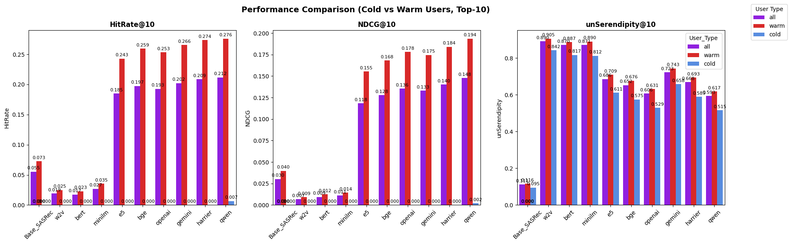
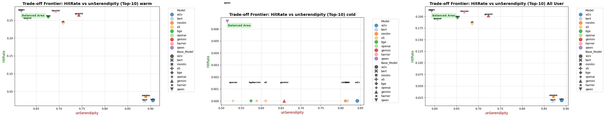
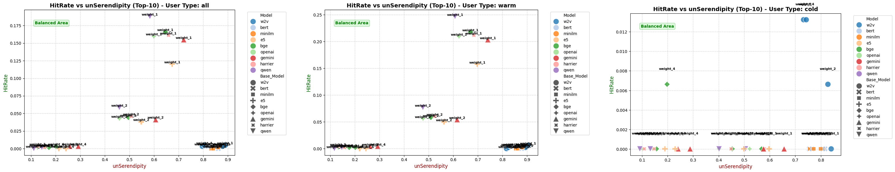

# Serendipitous Sequential Book Recommender

> A comparative study on the effectiveness of **LLM-based** versus **Word2Vec-based** embeddings in driving serendipitous sequential book recommendations, enhanced by the **SOG (Serendipity-Oriented Greedy) rerank algorithm** and applied to the UPNVJT Library dataset.

---

## 📖 About the Project

Traditional recommender systems often trap users in an "accuracy bubble," repeatedly suggesting items heavily overlapping with their past interactions. This repository contains the code and implementation for an advanced **Sequential Recommendation System (powered by SASRec)** designed to introduce **serendipity**—unexpected yet relevant discoveries—into library book recommendations.

The project substitutes different item embeddings (**Word2Vec** vs. **LLM-based**) into the sequential architecture, measures performance across standard ranking and serendipity metrics, and applies the **SOG rerank algorithm** (Kotkov et al.) to optimize unexpectedness and mitigate overspecialization.

---

## ⚙️ Core Architecture & Methodology


```

[ Library Logs / Data Prep ] ──> [ Notebooks (EDA & Preprocessing) ]
                                                │
                                                ▼
                                                [ Embedding Substitution ] ──> [ Sequential Recommender (SASRec) ]
                                                ├─ Word2Vec Embeddings                         │
                                                └─ LLM Embeddings                              ▼
                                                                      [ Initial Ranking Evaluation (@HR, @NDCG, @unSerendipity) ]
                                                                                               │
                                                                                               ▼
                                                                                   [ SOG Rerank Algorithm ]
                                                                                               │
                                                                                               ▼
                                                                             [ Final Recommendations & Web App (app/) ]

```

1. **Embedding Substitution:** Evaluates how spatial representations from Word2Vec (capturing lexical co-occurrences) compare against rich semantic embeddings from Large Language Models.
2. **Sequential Modeling (SASRec):** Captures the chronological evolution of a user's reading trajectory rather than isolated point interactions.
3. **SOG Reranking:** Implements the Serendipity-Oriented Greedy (SOG) algorithm to re-order recommendation lists via feature diversification, striking an optimal balance between relevance and unexpected delights. 

### SOG (Serendipity-Oriented Greedy) Reranking & Weighting Schemes

To optimize the balance between standard recommendation accuracy and unexpected discoveries, the **SOG rerank algorithm (Kotkov et al.)** is applied. SOG reranks the initial item list using a multi-criteria score balancing four key components:
* **Rel (Relevance):** Measures how closely the item matches the user's predicted preferences.
* **Div (Diversity):** Evaluates intra-list diversity to prevent recommending overly similar items.
* **Prof (Profile Distance):** Measures the distance/unexpectedness of the item relative to the user's historical profile.
* **UnPop (Unpopularity/Novelty):** Prioritizes niche or less frequently borrowed books to help uncover hidden gems.

Different weight configurations are tested to observe how shifting priorities (from accuracy-heavy to serendipity-heavy models) impact performance metrics.

| Alias | Rel | Div | Prof | UnPop | Description Focus |
| :--- | :---: | :---: | :---: | :---: | :--- |
| **Weight_1** | 0.7 | 0.1 | 0.1 | 0.1 | High focus on standard relevance (Accuracy-leaning) |
| **Weight_2** | 0.4 | 0.2 | 0.2 | 0.2 | Balanced trade-off across all criteria |
| **Weight_3** | 0.1 | 0.2 | 0.4 | 0.3 | Heavy focus on profile distance and unpopularity (Serendipity-leaning) |
| **Weight_4** | 0.1 | 0.3 | 0.3 | 0.3 | Balanced focus on diversity, profile distance, and unpopularity |

---

## 📊 Evaluation Metrics

The system is rigorously benchmarked using:
* **@HR (Hit Ratio):** Measures whether the target item appears within the top-K recommended list.
* **@NDCG (Normalized Discounted Cumulative Gain):** Evaluates the ranking quality, rewarding systems that place relevant items higher.
* **@unSerendipity:** Quantifies the unexpectedness and serendipitous value of recommendations relative to the user's historical profile.

---

## 📂 Repository Structure

```text
serendipitous-book-recommender/
│
├── app/                  # Web application interface for exploring recommendations
├── notebook/             # Jupyter notebooks for data preparation and model building
├── public_results/       # Evaluation outcomes and grid search logs for SASRec hyperparameters
└── requirements.txt      # Python dependencies

```

* **`app/`**: Contains the source code for the interactive frontend/web platform.
* **`notebook/`**: Houses step-by-step experimentation notebooks for exploratory data analysis, dataset preparation, and embedding pipelines.
* **`public_results/`**: Stores raw/processed evaluation results and grid search records used to tune the optimal hyperparameters for SASRec.

---

## 📂 Dataset Statistics

The system utilizes transaction logs from the **UPNVJT Library**. The dataset undergoes a rigorous cleaning and sequence-filtering pipeline (removing inactive users, handling sparse items, and structuring user interaction chronologically) before being fed into the sequential recommender.

| Metric | Raw Dataset | Processed Dataset (Modeling) |
| :--- | :---: | :---: |
| **Total Transactions / Logs** | *[~5.445]* | *[~5.440]* |
| **Unique Users** | *[1798]* | *[1798]* |
| **Unique Books / Items** | *[~55.000]* | *[~14.000]* |
| **Average Interactions per User** | *[2,98]* | *[2,98]* |

---

## 📊 Key Results
The effectiveness of our model is evaluated across different user segments to account for the **Cold Start** problem, measuring performance on new users (Cold), returning users (Warm), and the entire dataset (All).

### Performance Breakdown
#### Before Re-ranking
*Evaluation metrics across distinct user segments before re-ranking at (@10):*
| Variant | Test | HR | NDCG | unSer | %HR | %NDCG | %unSer | Diff | Significant? |
| :--- | :--- | :---: | :---: | :---: | :---: | :---: | :---: | :---: | :---: |
| **1. Base** | Warm | 0.073 | 0.040 | 0.116 | - | - | - | - | - |
| | Cold | 0.000 | 0.000 | 0.095 | - | - | - | - | - |
| | All | 0.055 | 0.030 | 0.111 | - | - | - | - | - |
| **2. w2v** | All | 0.031 | 0.009 | 0.890 | -53.48% | -71.02% | +711.83% | -0.035 | Yes |
| | Cold | 0.000 | 0.000 | 0.842 | +nan% | +nan% | +799.06% | +0.000 | No |
| | Warm | 0.040 | 0.012 | 0.905 | -53.48% | -71.02% | +689.51% | -0.047 | Yes |
| **3. Bert** | All | 0.035 | 0.014 | 0.870 | -46.72% | -57.92% | +693.75% | -0.031 | Yes |
| | Cold | 0.000 | 0.000 | 0.816 | +nan% | +nan% | +771.98% | +0.000 | No |
| | Warm | 0.046 | 0.018 | 0.887 | -46.72% | -57.92% | +673.73% | -0.041 | Yes |
| **4. Gemini** | All | 0.225 | 0.137 | 0.720 | +240.16% | +325.06% | +556.97% | +0.159 | Yes |
| | Cold | 0.000 | 0.000 | 0.655 | +nan% | +nan% | +599.40% | +0.000 | No |
| | Warm | 0.296 | 0.179 | 0.741 | +240.16% | +325.06% | +546.11% | +0.209 | Yes |
| **5. Openai** | All | 0.218 | 0.140 | 0.602 | +229.03% | +336.22% | +449.32% | +0.152 | Yes |
| | Cold | 0.004 | 0.001 | 0.525 | +inf% | +inf% | +460.65% | +0.004 | Yes |
| | Warm | 0.285 | 0.184 | 0.626 | +227.63% | +335.44% | +446.42% | +0.198 | Yes |
| **6. Qwen** | All | 0.239 | 0.153 | 0.588 | +260.24% | +375.28% | +436.63% | +0.172 | Yes |
| | Cold | 0.006 | 0.002 | 0.510 | +inf% | +inf% | +444.67% | +0.006 | Yes |
| | Warm | 0.312 | 0.200 | 0.613 | +258.25% | +374.04% | +434.57% | +0.225 | Yes |

*The following plots illustrate the performance convergence and serendipity improvements across the training epochs.*
<p align="center">
  
  <br>
  <em>Figure 1: Comparison of serendipity metrics across embedding strategies.</em>
</p>
<p align="center">
  
  <br>
  <em>Figure 2: Balance Analysis of serendipity and accuracy</em>
</p>

#### After Re-ranking
*Evaluation metrics across distinct user segments after re-ranking at (@10):*
<p align="center">
  
  <br>
  <em>Figure 3: Balance Analysis of serendipity and accuracy</em>
</p>

## 🛠️ Tech Stack

* **Language:** Python 3.10+
* **Deep Learning Framework:** PyTorch + Keras + Tensorflow
* **Embeddings & NLP:** Gensim (Word2Vec), Hugging Face / LLM Embeddings API
* **Web App:** React + FastAPI (refer to `app/`)
* **Data Processing & Analytics:** Pandas, NumPy, Scikit-learn

---

## 🚀 Getting Started

### Prerequisites

Ensure you have Python 3.10+ installed. Using a virtual environment is strongly recommended.

### Installation

1. **Clone the repository:**
```bash
git clone [https://github.com/your-username/serendipitous-book-recommender.git](https://github.com/your-username/serendipitous-book-recommender.git)
cd serendipitous-book-recommender

```


2. **Create and activate a virtual environment:**
```bash
python -m venv venv
source venv/bin/activate   # On Windows: venv\Scripts\activate

```


3. **Install dependencies:**
```bash
pip install -r requirements.txt

```

---

## 👥 Acknowledgments

* Developed as part of undergraduate research at **Universitas Pembangunan Nasional "Veteran" Jawa Timur (UPNVJT)**.
* Reranking methodology adapted from the **SOG algorithm framework by [Denis Kotkov et al.](https://link.springer.com/article/10.1007/s00607-018-0687-5)**
* Special thanks to thesis advisors and the UPNVJT Library unit for data support.

```

```
